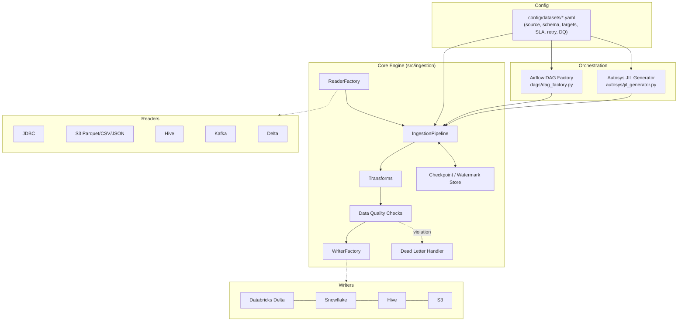

# Ingestion Framework

Config-driven PySpark data ingestion framework. Every dataset is described by a
single YAML config; the same config drives the Spark pipeline, the generated
Airflow DAG, and the generated Autosys JIL job network.

## Architecture



## Layout

```
src/ingestion/
  config/      Pydantic models + YAML/JSON loader for dataset configs
  readers/     BaseReader + JDBC/File/Hive/Kafka/Delta strategies + ReaderFactory
  writers/     BaseWriter + Databricks/Snowflake/Hive/S3 strategies + WriterFactory
  transforms/  Reusable DataFrame transforms (rename, cast, dedupe, metadata)
  utils/       Logging, metrics, secrets, retry, checkpoint, DQ checks, dead-letter
  pipeline.py  IngestionPipeline: reader -> transforms -> DQ -> writer(s)
  run_pipeline.py  CLI entrypoint shared by Airflow and Autosys jobs

dags/         Airflow DAG factory (one DAG per dataset config)
autosys/      Autosys JIL generator (config -> .jil, mirrors the Airflow graph)
config/datasets/  One YAML file per ingested dataset
tests/
  unit/        Fast tests against a local SparkSession (readers, writers, utils)
  integration/ Local Spark + local Delta + moto-mocked S3
  e2e/         Synthetic end-to-end pipeline run through the sample config
```

## Setup

```bash
conda create -n ingestion python=3.11
conda activate ingestion
conda install -c conda-forge openjdk=17
pip install -r requirements-dev.txt
pip install -e .
```

On Windows, Spark also needs `winutils.exe` + `hadoop.dll` for Hadoop 3.3.x on
`PATH`/`HADOOP_HOME` (see `tests/conftest.py` for the exact env vars). Airflow
itself does not run on native Windows (it imports the POSIX-only `fcntl`
module) — run the Airflow DAG factory under WSL2 or Linux/CI; the DAG-factory
test skips automatically on native Windows.

## Running tests

```bash
python -m pytest tests/unit          # fast, no external services
python -m pytest tests/integration   # local Spark + Delta + moto S3
python -m pytest tests/e2e           # synthetic dataset end-to-end
python -m pytest tests               # everything
```

## Adding a new dataset

1. Add `config/datasets/<name>.yaml` (see `customer_orders.yaml` for the full
   schema: source, targets, write_mode, retry, sla, data_quality).
2. `dags/dag_factory.py` and `autosys/jil_generator.py` both discover configs
   from `config/datasets/` automatically — no orchestration code to write.
3. Add a fixture-backed unit test under `tests/unit/` if the dataset exercises
   a new reader/writer combination.

## Write modes

- `append` — plain append, relies on the watermark column to avoid re-reading
  already-ingested rows.
- `overwrite` — full replace of the target.
- `merge` / `upsert` — requires `merge_keys`; Delta uses `DeltaTable.merge`,
  Snowflake stages then runs a `MERGE` statement, Hive/S3 emulate it via
  anti-join + swap since neither has a native merge writer.

See [`docs/runbook.md`](runbook.md) for on-call operating procedures.

## Container images

`docker/base` is the shared runtime (JDK 17 + Python 3.11 + pyspark 3.5.1 +
delta-spark 3.2.0 + boto3/structlog/pytest). Every reader/writer image extends
it and adds only that connector's jars/libs. All images share the same
`entrypoint.sh` contract (`--config-path`, optional `--dataset`, `--mode`) and
run the unmodified framework code via `spark-submit` (so bundled jars and
driver/executor memory settings actually take effect).

| Connector | Image | Key deps |
|---|---|---|
| base | `docker/base` | pyspark 3.5.1, delta-spark 3.2.0 |
| reader: JDBC | `docker/readers/jdbc` | postgres/mysql/oracle JDBC drivers (build-arg selectable) |
| reader: S3 | `docker/readers/s3` | hadoop-aws 3.3.4, aws-java-sdk-bundle 1.12.262 |
| reader: Hive | `docker/readers/hive` | hive-metastore/hive-exec/hive-jdbc 2.3.9 |
| reader: Kafka | `docker/readers/kafka` | spark-sql-kafka-0-10 3.5.1, kafka-clients 3.5.1 |
| reader: Databricks | `docker/readers/databricks` | delta-spark 3.2.0 jars, DatabricksJDBC42 (EULA, manual), databricks-sql-connector |
| writer: Databricks | `docker/writers/databricks` | same as reader: databricks |
| writer: Snowflake | `docker/writers/snowflake` | spark-snowflake 2.16.0-spark_3.5, snowflake-jdbc 3.16.1 |
| writer: Hive | `docker/writers/hive` | same as reader: hive |
| writer: S3 | `docker/writers/s3` | same as reader: s3 |

A single pipeline run needs the source connector's jars *and* every target
connector's jars on one classpath at once — a per-connector image alone isn't
enough for a real dataset job. Prod job images are built by layering the
needed reader + writer jar sets (see `docker/dev/local-e2e/Dockerfile` for the
pattern used locally with s3+hive; the same COPY --from technique produces
e.g. a `reader-s3-writer-databricks` image for `customer_orders`).

### Local dev stack

```bash
docker compose up --build
```

Spins up MinIO (S3 stand-in), a Postgres-backed Hive Metastore, and a runner
container that executes `config/datasets/customer_orders_local.yaml`
end-to-end in Spark local mode — no cloud credentials needed.

### Running in Kubernetes

Manifests are Kustomize-based:

- `k8s/base` — generic Job + CronJob templates + ServiceAccount
- `k8s/configmaps` — dataset YAML configs mounted as ConfigMaps (never baked into images)
- `k8s/secrets` — ExternalSecret templates (requires the [External Secrets Operator](https://external-secrets.io)); no plaintext credentials committed
- `k8s/jobs/<dataset>` and `k8s/cronjobs/<dataset>` — per-dataset overlays wiring a Job/CronJob to its ConfigMap, Secrets, and reader+writer image

Quickstart:

```bash
kubectl create namespace ingestion
kustomize build k8s/jobs/customer-orders | kubectl apply -n ingestion -f -
# scheduled variant:
kustomize build k8s/cronjobs/customer-orders | kubectl apply -n ingestion -f -
```

Spark runs via `spark-submit --master local[*]` inside the single pod
(no Spark-on-Kubernetes operator) — driver and executor share the pod's
resources, set via `SPARK_DRIVER_MEMORY`/`SPARK_EXECUTOR_MEMORY` env vars and
matched to the pod's `resources.requests/limits`. Chosen for simplicity: no
extra operator to install/maintain, and dataset volumes here don't need
multi-executor horizontal scaling. Switch to the Spark Operator if a dataset
outgrows a single pod.

### Validation checklist (no docker/kubectl in this dev environment)

Run these locally before trusting the images/manifests:

```bash
# build every image
docker build -f docker/base/Dockerfile -t ingestion-framework/base:latest .
docker build -f docker/readers/s3/Dockerfile -t ingestion-framework/reader-s3:latest .
docker build -f docker/writers/hive/Dockerfile -t ingestion-framework/writer-hive:latest .
# ...repeat for each docker/readers/*, docker/writers/* Dockerfile

# smoke test a connector image: import + version print
docker run --rm ingestion-framework/reader-s3:latest python3 -c "import pyspark; print(pyspark.__version__)"

# run the framework's own pytest suite inside an image
docker run --rm --entrypoint pytest ingestion-framework/reader-s3:latest tests/unit

# full local end-to-end
docker compose up --build --abort-on-container-exit --exit-code-from runner

# validate every kustomize overlay
for dir in k8s/jobs/*/ k8s/cronjobs/*/ k8s/configmaps k8s/secrets; do
  kustomize build "$dir" | kubectl apply --dry-run=client -f -
done
```

### Troubleshooting classpath/JAR conflicts

- **Hadoop/AWS SDK mismatch**: `hadoop-aws` must match the Hadoop version
  PySpark 3.5.1 was built against (3.3.4) *exactly* — mixing a newer
  `hadoop-aws` with the bundled `hadoop-client` throws
  `NoSuchMethodError` on `S3AFileSystem` init. Pin both together.
- **Delta version drift**: `delta-spark` (Python) and the `delta-spark`/`delta-storage`
  jars must be the same version (3.2.0) as pinned in `requirements.txt` — a
  mismatched jar version throws `DeltaAnalysisException` about an unreadable
  transaction log at startup.
- **Hive metastore client vs. server version**: Spark 3.5.1 bundles Hive 2.3.9
  client APIs. Pointing it at a newer standalone Hive Metastore (Hive 3.x/4.x)
  usually still works over the thrift API, but hive-exec/hive-metastore jars
  baked into the image must stay at 2.3.9 to match Spark's internal Hive
  classes, or you get `NoSuchMethodError`/`ClassNotFoundException` at
  metastore-client init.
- **Multiple connector jars on one classpath**: combining reader+writer jar
  sets (e.g. `hadoop-aws` + `spark-snowflake`) can pull in conflicting
  transitive Jackson/Guava versions. If you see
  `NoSuchMethodError`/`ClassNotFoundException` from an unrelated-looking
  class, check `jar tf` on both jars for a shared dependency and shade/exclude
  the older one.
- **Databricks JDBC driver missing at build time**: the build fails fast with
  `DatabricksJDBC42.jar not found` — it's EULA-gated and can't be
  auto-downloaded; fetch it manually from Databricks and place it under
  `docker/readers/databricks/drivers/` or `docker/writers/databricks/drivers/`.
- **Oracle JDBC driver**: excluded from `JDBC_DRIVERS` by default (license);
  pass `--build-arg JDBC_DRIVERS=postgres,mysql,oracle` explicitly when needed.
