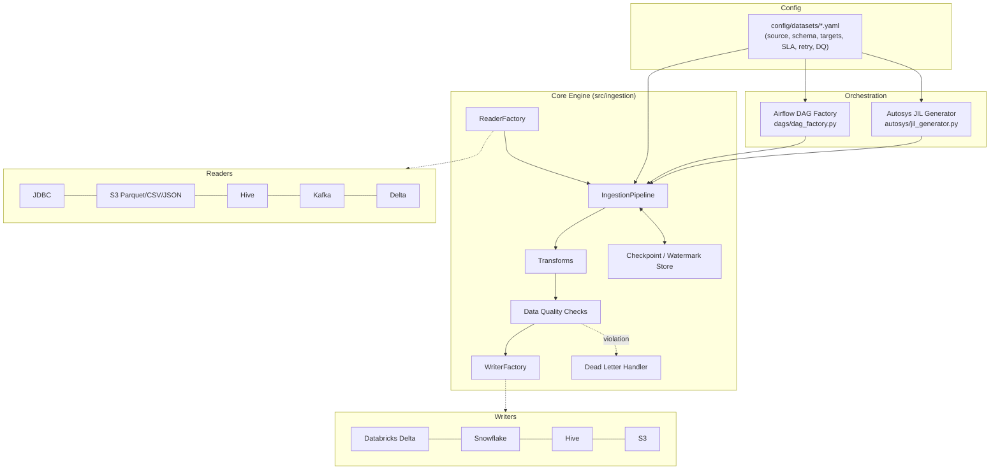

# Ingestion Framework

Config-driven PySpark data ingestion framework. Every dataset is described by a
single YAML config; the same config drives the Spark pipeline, the generated
Airflow DAG, and the generated Autosys JIL job network.

## Architecture



## Layout

```
src/ingestion/
  config/      Pydantic models + YAML/JSON loader for dataset configs
  readers/     BaseReader + JDBC/File/Hive/Kafka/Delta strategies + ReaderFactory
  writers/     BaseWriter + Databricks/Snowflake/Hive/S3 strategies + WriterFactory
  transforms/  Reusable DataFrame transforms (rename, cast, dedupe, metadata)
  utils/       Logging, metrics, secrets, retry, checkpoint, DQ checks, dead-letter
  pipeline.py  IngestionPipeline: reader -> transforms -> DQ -> writer(s)
  run_pipeline.py  CLI entrypoint shared by Airflow and Autosys jobs

dags/         Airflow DAG factory (one DAG per dataset config)
autosys/      Autosys JIL generator (config -> .jil, mirrors the Airflow graph)
config/datasets/  One YAML file per ingested dataset
tests/
  unit/        Fast tests against a local SparkSession (readers, writers, utils)
  integration/ Local Spark + local Delta + moto-mocked S3
  e2e/         Synthetic end-to-end pipeline run through the sample config
```

## Setup

```bash
conda create -n ingestion python=3.11
conda activate ingestion
conda install -c conda-forge openjdk=17
pip install -r requirements-dev.txt
pip install -e .
```

On Windows, Spark also needs `winutils.exe` + `hadoop.dll` for Hadoop 3.3.x on
`PATH`/`HADOOP_HOME` (see `tests/conftest.py` for the exact env vars). Airflow
itself does not run on native Windows (it imports the POSIX-only `fcntl`
module) — run the Airflow DAG factory under WSL2 or Linux/CI; the DAG-factory
test skips automatically on native Windows.

## Running tests

```bash
python -m pytest tests/unit          # fast, no external services
python -m pytest tests/integration   # local Spark + Delta + moto S3
python -m pytest tests/e2e           # synthetic dataset end-to-end
python -m pytest tests               # everything
```

## Adding a new dataset

1. Add `config/datasets/<name>.yaml` (see `customer_orders.yaml` for the full
   schema: source, targets, write_mode, retry, sla, data_quality).
2. `dags/dag_factory.py` and `autosys/jil_generator.py` both discover configs
   from `config/datasets/` automatically — no orchestration code to write.
3. Add a fixture-backed unit test under `tests/unit/` if the dataset exercises
   a new reader/writer combination.

## Write modes

- `append` — plain append, relies on the watermark column to avoid re-reading
  already-ingested rows.
- `overwrite` — full replace of the target.
- `merge` / `upsert` — requires `merge_keys`; Delta uses `DeltaTable.merge`,
  Snowflake stages then runs a `MERGE` statement, Hive/S3 emulate it via
  anti-join + swap since neither has a native merge writer.

See [`docs/runbook.md`](runbook.md) for on-call operating procedures.
