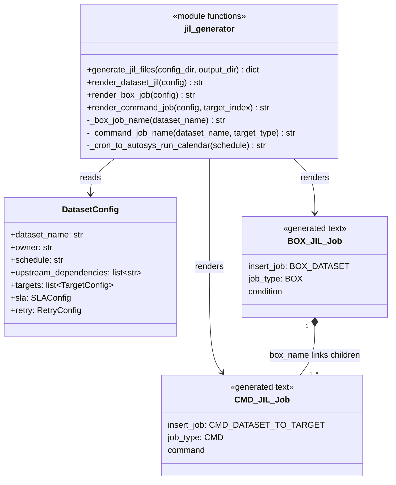

# Autosys JIL Generator (`autosys/`)

## What this folder does, in plain English

Some teams don't schedule jobs with Airflow — they use Autosys, an older
enterprise job scheduler that reads text job-definition files called **JIL**
(Job Information Language). This folder generates those JIL files from the
exact same dataset YAML configs that `dags/dag_factory.py` uses for Airflow.

Why this matters: both orchestrators (Airflow and Autosys) end up expressing
the *same* dependency graph and calling the *same* underlying Python code
(`python -m ingestion.run_pipeline`). Nobody has to maintain two separate
definitions of "what runs, when, and in what order" — one YAML file per
dataset drives both.

## File in this folder

- `jil_generator.py` — reads dataset configs, renders `.jil` text files, one
  per dataset, into `autosys/generated/`.

## Autosys concepts used here (quick primer for newcomers)

- **BOX job**: a container/folder job. Doesn't do work itself — it just groups
  other jobs and can depend on other boxes finishing successfully.
- **CMD job**: a job that runs an actual shell command.
- **condition**: Autosys's way of saying "don't start until X succeeds" —
  equivalent to Airflow's `ExternalTaskSensor`.

This generator creates **one BOX job per dataset** (named `BOX_<DATASET>`) and
**one CMD job per target** the dataset writes to (named
`CMD_<DATASET>_TO_<TARGET>`), nested inside that box.

## How generation works (step by step)

1. `generate_jil_files()` loads every YAML config in `config/datasets/`.
2. For each config, `render_dataset_jil()` builds the text for:
   - one BOX job (`render_box_job`) — carries the dataset's SLA
     (`max_run_alarm`), owner, and a `condition` line if the dataset has
     upstream dependencies (mirrors Airflow's sensors).
   - one CMD job per target (`render_command_job`) — the actual command run
     is `python -m ingestion.run_pipeline --dataset X --target-type Y
     --config-path config/datasets/X.yaml`, i.e. the identical CLI entrypoint
     Airflow's `PythonOperator` calls internally.
3. The rendered text is written to `autosys/generated/<dataset_name>.jil`.

Note: Autosys doesn't understand cron expressions natively.
`_cron_to_autosys_run_calendar` currently passes the cron string through
as-is — in a real deployment an operator maps it to an actual Autosys run
calendar / `start_times` during onboarding.

## Method reference

| Function | Purpose |
|---|---|
| `_box_job_name(dataset_name) -> str` | Builds the BOX job name, e.g. `BOX_ORDERS`. |
| `_command_job_name(dataset_name, target_type) -> str` | Builds the CMD job name, e.g. `CMD_ORDERS_TO_SNOWFLAKE`. |
| `_cron_to_autosys_run_calendar(schedule) -> str` | Passes a cron schedule string through unchanged (documented placeholder for real Autosys calendar mapping). |
| `render_box_job(config) -> str` | Renders the BOX job JIL block: owner, SLA alarm, and `condition` line built from `upstream_dependencies`. |
| `render_command_job(config, target_index) -> str` | Renders one CMD job JIL block for a single target: command line, retry count, stdout/stderr log paths, alert channel comment. |
| `render_dataset_jil(config) -> str` | Combines one BOX job + all its CMD jobs into the full JIL text for a dataset. |
| `generate_jil_files(config_dir=CONFIG_DIR, output_dir=None) -> dict[str, str]` | Loads all configs, renders JIL for each, writes files to `output_dir` (default `autosys/generated/`). Returns `{dataset_name: file_path}`. |

## Class / structure diagram

No custom classes — this module is a set of pure string-rendering functions
over `DatasetConfig`. Diagram shows the data flow:



## Running it

```bash
python -m autosys.jil_generator
```

Generated `.jil` files land in `autosys/generated/` (one per dataset), ready
to be handed to an Autosys admin for `jil` upload.

## Relationship to the rest of the repo

Both this folder and `dags/` are two different "front doors" (schedulers) onto
the same engine in `src/ingestion/` (see `src/ingestion/README.md`). Whichever
scheduler a given team runs, the dataset YAML config is the single source of
truth.
