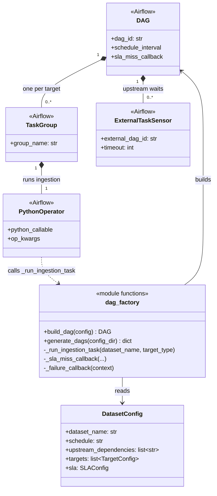

# Airflow DAGs (`dags/`)

## What this folder does, in plain English

This folder turns YAML config files (in `config/datasets/*.yaml`) into Airflow
pipelines automatically. You don't hand-write a DAG per dataset — you write one
YAML file describing "read from X, write to Y, run on this schedule, alert on
failure", and `dag_factory.py` builds the Airflow DAG for you.

Think of it as a factory: feed it a dataset config, get back a working,
schedulable pipeline with dependency waiting, timeouts, and failure alerts
already wired in.

## File in this folder

- `dag_factory.py` — the only file here. Generates one Airflow `DAG` object per
  dataset config found in `config/datasets/`.

## How a DAG gets built (step by step)

1. Airflow scans this file. At the bottom of the file, `generate_dags()` runs
   immediately at import time (Airflow re-imports DAG files every few minutes,
   so this regenerates DAGs whenever configs change).
2. For every YAML file in `config/datasets/`, one `DAG` is created, named
   `ingestion__<dataset_name>`.
3. Inside that DAG:
   - If the config lists `upstream_dependencies`, an `ExternalTaskSensor` is
     added per dependency — it waits for the upstream dataset's DAG to
     succeed before continuing.
   - For every target the dataset writes to (a dataset can fan out to more
     than one target, e.g. both Snowflake and S3), a `TaskGroup` is created
     containing one `PythonOperator` that actually runs the ingestion.
   - All target task groups wait on all upstream sensors.
4. Each task calls `_run_ingestion_task`, which builds a Spark session, loads
   the dataset's config, and runs `IngestionPipeline` (see
   `src/ingestion/README.md`).
5. If a task misses its SLA or fails, `_sla_miss_callback` / `_failure_callback`
   log a structured warning/error (a real deployment would also notify
   Slack/email using `config.sla.alert_channels`).

## Method reference

| Function | Purpose |
|---|---|
| `_run_ingestion_task(dataset_name, target_type=None)` | Task body executed by Airflow workers. Builds a `SparkSession`, loads the dataset config, optionally narrows it to one target type, runs `IngestionPipeline`, then stops Spark. |
| `_sla_miss_callback(dag, task_list, blocking_task_list, slas, blocking_tis)` | Called by Airflow when a task's SLA is missed. Logs a structured `sla_missed` warning. |
| `_failure_callback(context)` | Called by Airflow when a task fails. Logs a structured `task_failed` error with the DAG id, task id, and exception. |
| `build_dag(config: DatasetConfig) -> DAG` | Builds one complete `DAG` object for a single dataset config: sensors, task groups, default args, SLA/failure callbacks. |
| `generate_dags(config_dir=CONFIG_DIR) -> dict[str, DAG]` | Loads every dataset config in `config_dir` and calls `build_dag` on each. Returns `{dataset_name: DAG}`. |

## Class / structure diagram

`dag_factory.py` has no custom classes of its own — it composes Airflow's
built-in classes. This diagram shows how the pieces relate:

## Where the real work happens

This file only wires up scheduling and orchestration. The actual
extract/transform/quality-check/write logic lives in `src/ingestion/` — see
`src/ingestion/README.md`. Autosys's equivalent job graph (for teams not using
Airflow) is generated from the exact same YAML configs by `autosys/` — see
`autosys/README.md`.
