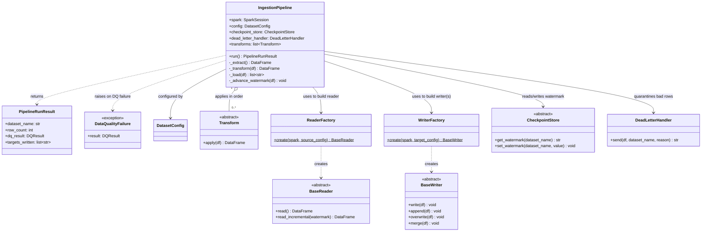

# Ingestion Engine (`src/ingestion/`)

## What this folder does, in plain English

This is the core engine that actually moves data. Everything else in the repo
(`dags/`, `autosys/`) just decides **when** to run a job — this folder is
**what runs**. Given a dataset's YAML config, it:

1. **Reads** data from a source (a database, S3, Hive, Kafka, Delta Lake).
2. **Transforms** it (rename/cast columns, dedupe, add metadata columns).
3. **Checks data quality** (row counts, null rates, expected columns).
4. **Writes** it to one or more targets (Snowflake, Databricks Delta, Hive, S3).
5. Tracks **checkpoints** (watermarks) so re-runs only pick up new data,
   **retries** failed writes with backoff, and **quarantines** bad rows to a
   dead-letter location instead of silently dropping them.

If you're new: think of this like a mail-sorting facility. Mail (data) comes
in one of several trucks (readers), gets sorted and re-labeled (transforms),
inspected for damage (quality checks), and shipped out on one or more trucks
to different destinations (writers). If a shipment looks broken, it goes to a
special "damaged goods" shelf (dead-letter queue) instead of being delivered.

## Folder layout

```
src/ingestion/
├── pipeline.py          # the orchestrator: IngestionPipeline
├── run_pipeline.py       # CLI entrypoint (used by Airflow + Autosys)
├── config/                # YAML config parsing + validation (Pydantic models)
│   ├── models.py
│   └── loader.py
├── readers/               # one class per source system
│   ├── base.py
│   ├── factory.py
│   ├── file_reader.py     # S3 parquet/csv/json
│   ├── hive_reader.py
│   ├── jdbc_reader.py     # any JDBC DB: Postgres/MySQL/Oracle/SQL Server
│   ├── kafka_reader.py
│   └── delta_reader.py
├── writers/                # one class per destination system
│   ├── base.py
│   ├── factory.py
│   ├── hive_writer.py
│   ├── s3_writer.py
│   ├── databricks_writer.py
│   ├── snowflake_writer.py
│   └── _snowflake_utils.py
├── transforms/             # DataFrame -> DataFrame steps
│   ├── base.py
│   └── column_transforms.py
└── utils/                  # cross-cutting concerns
    ├── checkpoint.py       # watermark tracking for incremental loads
    ├── dead_letter.py       # quarantine bad rows
    ├── logging_utils.py      # structured JSON logging
    ├── metrics.py            # metric emission
    ├── quality.py            # data quality checks
    ├── retry.py              # retry/backoff decorator
    └── secrets.py            # env var / Vault secret resolution
```

## The one-sentence mental model

**`IngestionPipeline.run()`** = `extract` -> `transform` -> `quality check` ->
(maybe quarantine) -> `load` (write to every target) -> `advance the watermark`.

## Config layer (`config/`)

Every dataset is described by one YAML/JSON file, validated into a
`DatasetConfig` (a Pydantic model — Pydantic just means "the config gets
type-checked and validated automatically when loaded, and you get a clear
error if something's missing or malformed").

- **`models.py`** — defines the shape of a valid config:
  - `SourceConfig` (what to read from, e.g. `jdbc`, `s3_parquet`, `hive`,
    `kafka`, `delta`) and `TargetConfig` (what to write to, e.g.
    `databricks_delta`, `snowflake`, `hive`, `s3`), each an `Enum` of allowed
    types.
  - `WriteMode`: `append`, `overwrite`, `merge`, `upsert`. If you pick `merge`
    or `upsert`, you *must* also supply `merge_keys` (enforced by a
    validator) — otherwise the config fails to load with a clear error
    instead of failing at runtime mid-pipeline.
  - `RetryConfig`, `SLAConfig`, `DataQualityConfig` — tunable knobs per
    dataset.
  - `DatasetConfig` — the top-level object combining all of the above, plus
    `schedule` (cron string), `upstream_dependencies` (dataset names this one
    waits on), and `tags`.
- **`loader.py`** — `load_config(path)` reads one YAML/JSON file into a
  `DatasetConfig`. `load_config_dir(directory)` loads every config file in a
  directory (used by `dag_factory.py` and `jil_generator.py` to build the full
  dataset graph).

## Readers (`readers/`) — the "extract" step

All readers share one shape: `BaseReader.read()` returns a Spark `DataFrame`.
`read_incremental(watermark)` (defined once on `BaseReader`, inherited by all)
wraps `read()` and filters on the source's `watermark_column` if the source
has previously recorded a watermark — this is how incremental/delta loads
work without every reader re-implementing the same filter logic.

| Reader | Reads from | Notes |
|---|---|---|
| `FileReader` | S3 (or any Hadoop-compatible filesystem) | Format (`parquet`/`csv`/`json`) picked from `SourceType`. CSV defaults to `header=true`, `inferSchema=true`. |
| `HiveReader` | Hive metastore table | Optional `partition_filter` option applied as a `.filter()`. |
| `JdbcReader` | Any JDBC source (Postgres/MySQL/Oracle/SQL Server/...) | Resolves `password_secret` via `secrets.py` instead of taking a plaintext password. Accepts `query` or `dbtable`. |
| `KafkaReader` | Kafka topic (batch read) | Optionally parses the Kafka `value` bytes as JSON using a supplied `value_schema`. |
| `DeltaReader` | Delta Lake table | By `table` (metastore name) or `path`. |

`ReaderFactory.create(spark, source_config)` picks the right reader class
based on `source_config.type`, via a small registry dict — so adding a new
source type later is a one-line `ReaderFactory.register(...)` call, no
`if/elif` chain to touch.

## Writers (`writers/`) — the "load" step

All writers share one shape: `BaseWriter.write(df)` looks at
`target_config.write_mode` and dispatches to `append()`, `overwrite()`, or
`merge()` (used for both `merge` and `upsert` modes). Each concrete writer
implements those three methods for its destination system.

| Writer | Writes to | Merge/upsert strategy |
|---|---|---|
| `HiveWriter` | Hive table | No native MERGE — emulates it: anti-join existing rows against new rows on `merge_keys`, combine, write to a staging table, then swap the staging table in for the real one (Spark can't overwrite a table it's currently reading from). Runs `MSCK REPAIR TABLE` after partitioned writes. |
| `S3Writer` | S3 (parquet/etc.) | Same anti-join-then-overwrite emulation as Hive. Also writes a JSON **manifest** file (row count, timestamp, checksum) alongside the data for downstream consumers to verify completeness. |
| `DatabricksWriter` | Delta Lake table/path | Uses Delta Lake's real `MERGE` via the `DeltaTable` API (`whenMatchedUpdateAll` / `whenNotMatchedInsertAll`) — no anti-join hack needed, Delta supports merge natively. |
| `SnowflakeWriter` | Snowflake table | Writes new rows to a staging table via the Spark Snowflake connector, then runs a raw SQL `MERGE INTO ... USING staging` statement through `_snowflake_utils.run_snowflake_query`. |

`WriterFactory.create(spark, target_config)` picks the writer class the same
way `ReaderFactory` does — registry dict keyed by `TargetType`.

## Transforms (`transforms/`) — the "transform" step

`Transform.apply(df) -> df` is the only method. Pipeline runs a list of these
in order. Built-in transforms in `column_transforms.py`:

| Transform | Does |
|---|---|
| `ColumnRename(mapping)` | Renames columns per a `{old: new}` dict. |
| `ColumnCast(casts)` | Casts columns to Spark types per a `{column: type}` dict. |
| `AddIngestionMetadata(dataset_name)` | Adds `_ingested_at` (current timestamp) and `_dataset_name` columns — audit trail. |
| `DropColumns(columns)` | Drops listed columns. |
| `Deduplicate(keys, order_by=None)` | Drops duplicate rows by key. If `order_by` is given, keeps the most recent row per key (via a window function ranking) instead of an arbitrary one. |

## Utilities (`utils/`)

| Module | Responsibility |
|---|---|
| `checkpoint.py` | `CheckpointStore` interface + `FileCheckpointStore` (JSON file per dataset). Tracks the last-seen watermark value so incremental reads only pull new rows. |
| `dead_letter.py` | `DeadLetterHandler.send(df, dataset_name, reason)` — writes quarantined rows to a DLQ path as parquet, tagged with the failure reason. |
| `logging_utils.py` | `get_logger(name)` — structured JSON logs to stdout (easy to ship to any log aggregator). |
| `metrics.py` | `emit_metric(name, value, tags)` — pluggable metrics emitter (defaults to logging; swap via `set_emitter` for StatsD/CloudWatch in production). |
| `quality.py` | `run_quality_checks(df, config, expected_fields)` — checks minimum row count, max null fraction per column, and expected schema fields. Returns a `DQResult` with any `DQViolation`s. |
| `retry.py` | `with_retry(retry_config)` — decorator that retries a function with exponential backoff, driven entirely by a dataset's `RetryConfig`. |
| `secrets.py` | `resolve_secret("env:VAR")` or `resolve_secret("vault:path#key")` — never put plaintext passwords in a YAML config. |

## The orchestrator: `pipeline.py`

`IngestionPipeline` is the class that ties everything above together.



### `IngestionPipeline` method reference

| Method | What it does |
|---|---|
| `__init__(spark, config, checkpoint_store=None, dead_letter_handler=None, transforms=None)` | Wires up dependencies. Defaults to a `FileCheckpointStore(".checkpoints")` if none given. |
| `_extract() -> DataFrame` | Builds the right reader via `ReaderFactory`, looks up the last watermark, calls `read_incremental(watermark)`. |
| `_transform(df) -> DataFrame` | Runs every configured `Transform` in order over the DataFrame. |
| `_load(df) -> list[str]` | For every target in the config, builds the right writer via `WriterFactory`, wraps its `write` method with retry/backoff (`with_retry`), and calls it. Returns the list of target types written. |
| `_advance_watermark(df) -> None` | If the source has a `watermark_column`, computes its max value in this batch and saves it to the checkpoint store for the next run. |
| `run() -> PipelineRunResult` | The full sequence: extract, transform, cache, run quality checks, emit metrics, quarantine to DLQ + optionally raise `DataQualityFailure` if checks fail and `fail_pipeline_on_violation` is set, otherwise load to all targets and advance the watermark. |

### What happens when data quality checks fail

1. `run_quality_checks` returns a `DQResult` with `passed=False` and a list of
   `DQViolation`s (e.g. "too many nulls in column X").
2. A `ingestion.dq_violations` metric is emitted.
3. If a `dead_letter_handler` is configured, the *entire* batch is sent there
   (not deleted — just also quarantined for inspection).
4. If `config.data_quality.fail_pipeline_on_violation` is `True` (the
   default), a `DataQualityFailure` exception is raised, which fails the
   Airflow task / Autosys job — nobody has to remember to check a dashboard.

## CLI entrypoint: `run_pipeline.py`

This is the actual command both Airflow's `PythonOperator` and Autosys's CMD
jobs invoke under the hood (`python -m ingestion.run_pipeline --dataset X
--config-path Y`). Having one shared entrypoint means both schedulers run the
exact same code path — no drift between "how Airflow runs it" and "how
Autosys runs it".

| Function | Purpose |
|---|---|
| `parse_args(argv=None)` | Parses `--dataset`, `--config-path`, `--target-type` CLI flags. |
| `main(argv=None) -> int` | Loads the config, optionally narrows to one target type, builds a Spark session, runs `IngestionPipeline`, always stops Spark in a `finally` block. |

## Adding a new source or destination

Because readers/writers are registered in a factory dict rather than a big
`if/elif`, adding support for a new system is:

1. Add the new type to `SourceType` or `TargetType` in `config/models.py`.
2. Write a new `BaseReader`/`BaseWriter` subclass implementing `read()` (or
   `append`/`overwrite`/`merge`).
3. Register it: `ReaderFactory.register(SourceType.NEW, NewReader)` (or the
   writer equivalent).

No existing code needs to change.
